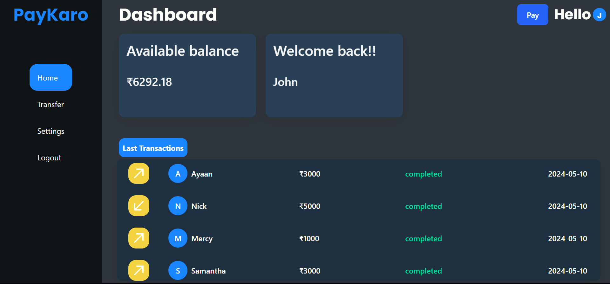

## Paykaro

This is a description of the project.


## Features

- Feature 1
- Feature 2
- Feature 3

## Installation

Follow these steps to set up and run the project locally:

### 1. Clone the repository

```sh
git clone https://github.com/Mahesh7979/Paykaro.git
cd Paykaro
```

### Install server dependencies
```sh
cd server
npm install
```

### Install client dependencies
```sh
cd client
npm install
```

### Server Configuration
Create a .env file in the server directory and add your MongoDB URI and any other necessary environment variables:
```sh
MONGO_URI=your-mongodb-uri
PORT=5000
JWT_SECRET=your-jwt-secret
```


##  Start the Server and Client

```sh
cd server
npm start
```
```sh
cd ../client
npm run dev

